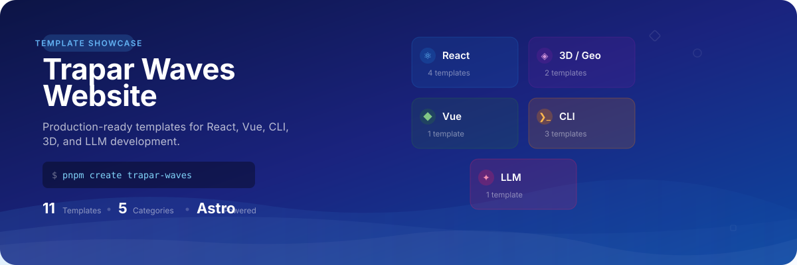

<p align="center">
  
</p>

<div align="center">

[](https://trapar-waves.github.io/website)
[](https://astro.build)
[](https://tailwindcss.com)
[](https://www.typescriptlang.org)

</div>

---

## What It Is

This website serves as the central hub for browsing and discovering templates in the [Trapar Waves](https://github.com/trapar-waves) workspace. It aggregates metadata, GitHub repository stats, and npm download data into a filterable catalog with bilingual support (English / Chinese).

**11 templates** across **5 categories**:

| Category | Templates | Stack |
|----------|-----------|-------|
| **React** | `react-tailwind`, `react-mantine-tailwind`, `react-tanstack`, `react-antd-pro` | React, Tailwind, Mantine, Ant Design, TanStack, Rsbuild |
| **3D / Geo** | `react-three-maplibre`, `react-visgl-maplibre` | Three.js, Deck.gl, MapLibre |
| **Vue** | `vue-tailwind` | Vue 3, Tailwind, Rsbuild |
| **CLI** | `cli-template`, `Captain`, `create-trapar-waves` | tsup, consola, picocolors, Rslib |
| **LLM** | `llm-template` | Vercel AI SDK, Zod, Vitest |

## Quick Start

```bash
# Install dependencies
pnpm install

# Start development server
pnpm dev

# Build for production
pnpm build

# Preview production build
pnpm preview
```

## How It Works

```
src/
├── components/          # Astro components
│   ├── Hero.astro           # Landing section with animated stats
│   ├── TemplateCard.astro   # Individual template display card
│   ├── CategoryFilter.astro # Filter bar by category
│   ├── Header.astro         # Site navigation
│   ├── Footer.astro         # Site footer
│   ├── AnimatedCounter.astro# Number animation for stats
│   └── WaveBackground.astro # Decorative wave animation
├── data/
│   └── templates.ts     # Template registry (metadata, categories, npm/GitHub refs)
├── lib/
│   ├── data.ts          # Build-time data aggregation
│   ├── github.ts        # GitHub API integration (stars, last updated)
│   ├── npm.ts           # npm API integration (download counts)
│   └── icons.ts         # Icon resolution
├── pages/
│   ├── index.astro      # English homepage
│   ├── zh/index.astro   # Chinese homepage
│   └── 404.astro        # Custom 404 page
├── layouts/
│   └── Layout.astro     # Base HTML layout
├── styles/
│   └── global.css       # Global styles and Tailwind config
└── types/
    └── template.ts      # TypeScript interfaces
```

**Data flow:** At build time, `data.ts` fetches live GitHub stars and npm download counts for every template defined in `templates.ts`, then passes the enriched data to the page components.

## Tech Stack

| Layer | Tool | Purpose |
|-------|------|---------|
| Framework | [Astro 7.2](https://astro.build) | Static site generation, island architecture |
| Styling | [Tailwind CSS 4.3](https://tailwindcss.com) | Utility-first CSS via Vite plugin |
| Language | [TypeScript 5.x](https://www.typescriptlang.org) | Type safety across components and data |
| Fonts | Inter, Space Grotesk, JetBrains Mono | UI text, display headings, code blocks |
| Icons | [Lucide](https://lucide.dev) | Lightweight icon set |
| SEO | `@astrojs/sitemap` | Automatic sitemap generation |
| Deploy | GitHub Pages | Static hosting via CI/CD |

## Deployment

Pushing to the `main` branch triggers an automated deployment to [GitHub Pages](https://trapar-waves.github.io/website) via the `deploy.yml` workflow:

1. **Build** — checks out the repo, installs pnpm, runs `pnpm build`
2. **Upload** — uploads the `dist/` artifact
3. **Deploy** — publishes to GitHub Pages

## Related Projects

This website showcases templates from the [Trapar Waves](https://github.com/trapar-waves) workspace. To bootstrap a project from any template:

```bash
pnpm create trapar-waves
```

Or browse the catalog at [trapar-waves.org](https://trapar-waves.github.io/website).

## License

Part of the [Trapar Waves](https://github.com/trapar-waves) workspace.
